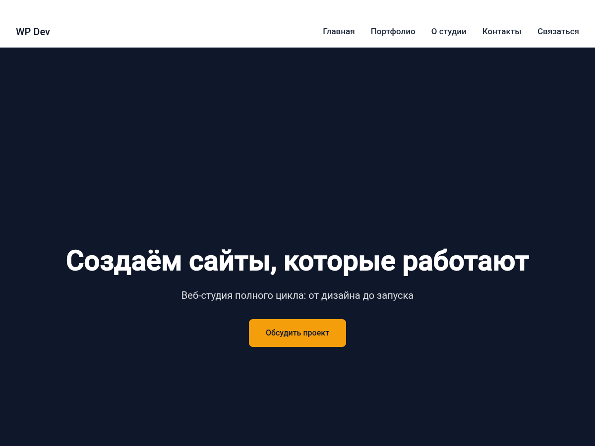

# Web Studio Landing — тема WordPress

[](https://github.com/AlSokolov2/web-studio-landing/actions/workflows/ci.yml)
[](https://wordpress.org/)
[](https://www.php.net/)
[](https://creativecommons.org/licenses/by-nc/4.0/)
[](https://developer.wordpress.org/coding-standards/wordpress-coding-standards/php/)

Тема-визитка для веб-студии на чистом коде. Без конструкторов, без jQuery, без лишнего.



## Возможности

- **Hero-секция** — первый экран с CTA-кнопкой, настраивается в Кастомайзере
- **Портфолио** — кастомный тип записей с категориями, CSS Grid-галерея, lazy loading
- **О студии** — описание компании и блок преимуществ
- **Контакты** — телефон, email, адрес, соцсети с микроразметкой Schema.org LocalBusiness
- **Форма обратной связи** — AJAX-отправка, валидация на клиенте и сервере, nonce + honeypot-защита
- **Адаптивность** — mobile-first, CSS Grid + Flexbox, 4 брейкпоинта
- **Доступность** — skip-link, ARIA-атрибуты, :focus-visible, reduced-motion
- **Производительность** — системный шрифт, SVG-иконки inline, deferred JS, lazy images
- **Кастомайзер** — 16 настроек, редактирование контента в реальном времени
- **Без jQuery** — ванильный JS, IntersectionObserver, Fetch API
- **WPCS-совместимость** — код проходит `phpcs --standard=WordPress-Extra` (с пробелами вместо табов)
- **Полный перевод** — русский язык, Text Domain `web-studio-landing`

## Требования

| Компонент | Минимальная версия |
|---|---|
| WordPress | 6.0 |
| PHP | 8.0 |
| Браузеры | Chrome 90+, Firefox 90+, Safari 15.4+, Edge 90+ |

## Быстрый старт

```bash
# 1. Клонируйте тему в wp-content/themes/
cd wp-content/themes/
git clone https://github.com/AlSokolov2/web-studio-landing.git

# 2. Активируйте в админке
wp theme activate web-studio

# 3. Создайте главную страницу
wp post create --post_type=page --post_title="Главная" --post_status=publish
wp option update show_on_front page
wp option update page_on_front $(wp post list --post_type=page --field=ID --posts_per_page=1)

# 4. Добавьте меню с якорными ссылками
wp menu create "Main Menu"
wp menu location assign "Main Menu" primary
wp menu item add-custom "Main Menu" "Портфолио" "#portfolio"
wp menu item add-custom "Main Menu" "Контакты" "#contacts"
```

## Структура темы

```
web-studio/
├── style.css                    # Метаданные темы
├── functions.php                # Хуки, enqueue, SVG-хелпер, санитайзер
├── index.php / page.php         # Шаблоны страниц
├── header.php / footer.php      # Шапка и подвал
├── front-page.php               # Главная (собирает секции)
├── 404.php                      # Страница не найдена
├── screenshot.png               # Превью темы
├── assets/
│   ├── css/main.css             # Все стили (mobile-first, CSS Grid)
│   ├── js/main.js               # AJAX-форма, скролл, анимации
│   └── js/navigation.js         # Мобильное меню
├── template-parts/
│   ├── section-hero.php         # Первый экран
│   ├── section-portfolio.php    # Портфолио (WP_Query)
│   ├── section-about.php        # О студии
│   ├── section-contacts.php     # Контакты + Schema.org
│   └── section-feedback.php     # Форма обратной связи
├── inc/
│   ├── cpt-portfolio.php        # CPT + таксономия
│   ├── class-web-studio-landing-customizer.php  # 16 настроек Кастомайзера
│   └── class-web-studio-landing-ajax-handler.php # Обработчик формы
├── languages/                   # .pot / .po / .mo
└── phpcs.xml                    # Конфиг PHP_CodeSniffer
```

## Настройка в Кастомайзере

**Внешний вид → Настроить:**

| Секция | Настройки |
|---|---|
| Hero (первый экран) | Заголовок, подзаголовок, кнопка (текст + ссылка), фон |
| Портфолио | Заголовок секции |
| О студии | Заголовок, текст, изображение |
| Контакты | Заголовок, телефон, email, адрес, соцсети (JSON) |
| Форма обратной связи | Заголовок, описание |
| Подвал (footer) | Текст копирайта |

> **Соцсети** — JSON-массив в формате:
> ```json
> [{"icon":"phone","label":"Telegram","url":"https://t.me/username"}]
> ```
> Доступные иконки: `code`, `design`, `support`, `phone`, `email`, `location`, `link`.

## Лицензия

[CC BY-NC 4.0](https://creativecommons.org/licenses/by-nc/4.0/) — свободное некоммерческое использование с указанием авторства.

## Автор

**[Alekzander](https://github.com/AlSokolov2)**
